# Configura tu entorno
## 1 Prepara el teu entorn 
### 1.1. Fes que el teu terminal estigui en anglès 

Con este comando cambiaremos el idioma temporalmente

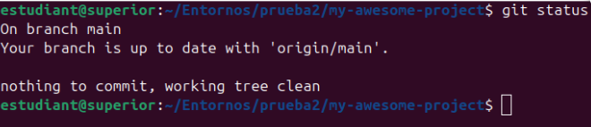

### 1.2. Crea un alias que apunti al directori de repositoris del mòdul d’entorns

he entrado a un archivo bashrc para poner un alias para que me lleve a /home/estudiant/Entornos donde alli esta my-awesome-proyect

 
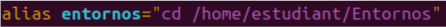
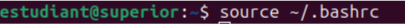

### 1.3. Fes que el teu repositori (tria un dels que tinguis) tingui els següents  Settings: ff = true i pull.rebase = false 

he entrado a my-awesome-proyect y alli he hecho los siguientes comandos

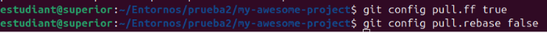

### 1.4. Com faries que els canvis del teu entorn siguin permanents? 

He modificado el archivo ~/.bashrc he editar el idioma y el alias entorno asi estara permanentemente  y luego he hecho source ~/.bashrc para guardarlo todo

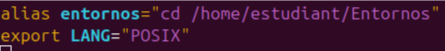
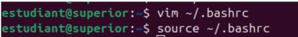

## 2. git log 

Amb git log obtenim l’històric de canvis del nostre repositori 

### 2.1. Fes que git log mostri el commit sha, l’autor i la data
con el siguinete comando sale el sha ,autor , i data

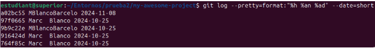

### 2.2. Com pots veure l’historial de canvis sobre un fitxer? És a dir com mostraries els commits que han modificat aquest fitxer

 
2.3. Donat un commit sha, mostra els fitxers modificats per aquest commit 

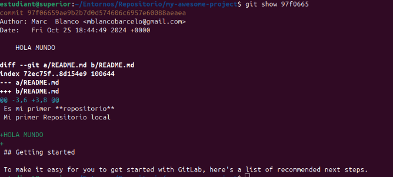

2.4. Quines altres opcions t’ofereix git log? Proposa 2 opcions que pensis que et  poden ser d’utilitat. 

con el –grip=”lineadeltexto” podremos buscar algo especifico en el archivo
con –reverse podremos ver los primeros commits hechos en el proyecto

## 3. Conflictes 
En cas d’un conflicte entre el teu repositori local i el remot 
### 3.1. Com mostraries els fitxers afectats 
he forzado un error entre el el remoto y el local

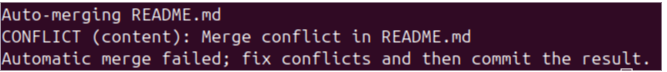

He abierto el archivo con vim para ver lo que se ha modificado

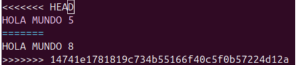

### 3.2. Es pot deixar un conflicte sense resoldre i pujar-ho al repositori remot? 
No,si lo intentamos subir con errores  no nos dejará

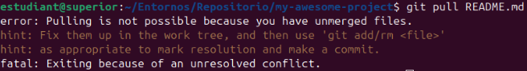